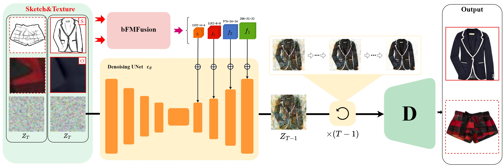

# Bidirectional Feature Modulation Fusion for Fashion Design Using Latent Diffusion Models



# TODO

- [x] processed datasets

- [x] training code

- [x] inference code

- [x] demo model

# 1. Environment

```sh
git clone https://github.com/zibingo/BF-Fashion.git
cd BF-Fashion
conda env create -f environment.yaml
conda activate ldm
pip install -e .
cd src/taming-transformers
pip install -e .
cd ../..
```

Download [Pretrained Autoencoding Models](https://ommer-lab.com/files/latent-diffusion/vq-f8.zip) and unzip it to the "models\first_stage_models\vq-f8"

# 2. Data preparation

1. Download the [Cleaned Type-aware Dataset](https://github.com/AemikaChow/AiDLab-fAshIon-Data/blob/main/Datasets/cleaned-type.md) and apply [HED](https://github.com/s9xie/hed) to generate sketches.

2. You can also download our [processed dataset](https://drive.google.com/file/d/1E5HW_17IfjfkBlEPLCaE6mbjPtWvJU2H/view?usp=drive_link) to the root of your project folder.

## 3. Modify the configuration file

> Modify the absolute path in the configuration file

```sh
sed -i "s|/workspace/BF-Fashion|$(pwd)|g" configs/latent-diffusion/mydata_ldm-vq-f8.yaml
sed -i "s|/workspace/BF-Fashion|$(pwd)|g" configs/latent-diffusion/mydata_ldm-vq-f8_test.yaml
```

# 4. Training

```sh
sh run_train.sh
```

# 5. Inference

Download checkpoints [here](d) and Put it in the root of the project folder

```sh
sh run_batch_sample.sh
```

# 6. Demo

```sh
python gradio_img2img.py
```

# 7. Calculate Metrics

```sh
python m_class_fid_lpips.py
python m_class_histo_loss.py
```

# Acknowledgement

We would like to express our gratitude to the authors of the [**Cleaned Maryland Dataset**](https://github.com/AemikaChow/AiDLab-fAshIon-Data/blob/main/Datasets/cleaned-maryland.md) for providing a valuable resource that has greatly supported our work. 
